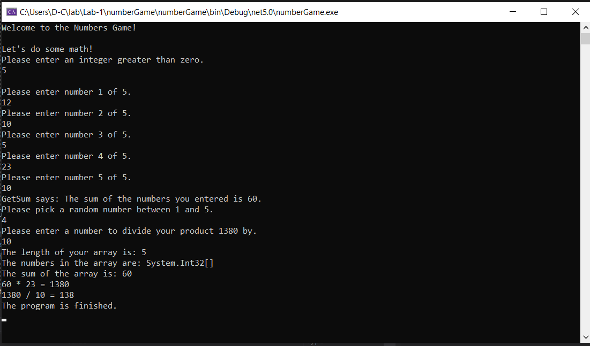
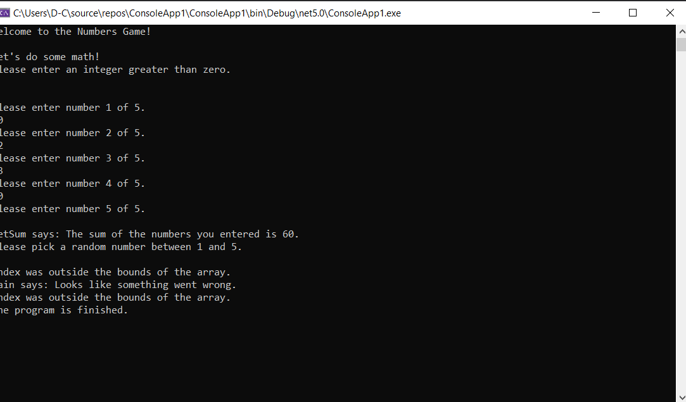

# Lab-1 Numbers Game

---

## Description
*This is a C# console application that will prompt a user to enter several numbers and then will perform several math operations with those numbers.*

---
## Getting Started

Clone this repository to your local machine.

**$ git clone [repo url here]**
To run the program from Visual Studio:
Select File -> Open -> Project/Solution

Next navigate to the location where you cloned the repository.

Double-click on the Lab01-Numbers-Game directory.

Then select and open Lab01-Numbers-Game.sln

---
## Visuals

**Application Start**

**Application Use and Output**

**Exception Handling**
